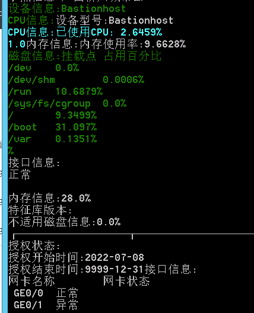
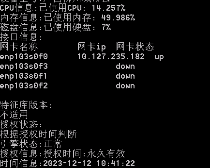
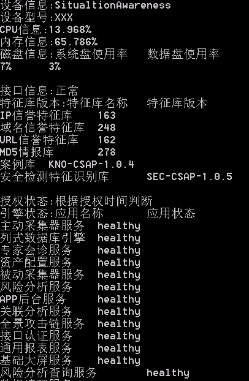

# H3C安全设备自动巡检工具

## 简介

H3C安全设备巡检模版，不同型号设备需要微调。

## WHY

日常巡检太麻烦，加上这些设备都没有接口。

## 如何执行

安装完依赖库之后执行`python main.py`

## 工作原理

通过爬虫爬去相应数据，js逆向分析页面代码逻辑，进行汇总。

### 代码复用

NTA、IPS几乎可以共享所有代码

## TODO

- [ ] 输出优化

## 支持设备

- [x] 堡垒机

- [x] 态势感知

- [x] 日审

- [x] 数审

- [x] WAF

- [x] NTA

- [x] 主机安全(青藤)

- [x] 漏扫

## 运行截图

### 堡垒机巡检

### 日审巡检

### 态势感知巡检

